<div align="center">
  <a href="https://github.com/JuustMarwan/UnicodesAPI">
    
  </a>
<h2 align="center">UnicodesAPI</h2>

  <p align="center">
    A Pocketmine Plugin For Accessing And Using Minecraft Bedrock Unicode Characters At Ease .
    <br />
    <a href="https://poggit.pmmp.io/p/UnicodesAPI"></a>
    <a href="https://poggit.pmmp.io/p/UnicodesAPI"></a>
    <br />
    <a href="https://github.com/JuustMarwan/UnicodesAPI/releases">Releases</a>
    ·
    <a href="https://github.com/JuustMarwan/UnicodesAPI/issues">Report Issue</a>
    ·
    <a href="https://wiki.bedrock.dev/concepts/emojis">Unicodes Wiki</a>
  </p>
</div>
<br />

### Before Using UnicodesAPI:


### After Using UnicodesAPI:


<br />

### Using Unicode Character:
```php
use UnicodesAPI/Base as UnicodesAPI;

echo UnicodesAPI::MINECOIN;
sendMessage(UnicodesAPI::MINECOIN);
```

### Using **replace()** function:
The replace function will replace the unicode character name put in curly braces in the string given.
```php
use UnicodesAPI/Base as UnicodesAPI;

//Method 1
UnicodesAPI::replace("{MINECOIN} is a currency {HEART}.");

//Method 2
$message = $event->getMessage();
UnicodesAPI::replace($message);
```

### Config or Settings:
```yml
---
# If This Is Set true Unicode Name Written In {} While PlayerChatEvent() Will Be Replaced With Actual Unicode Characters.
# But If It's Set False Unicode Name Won't Be Replaced.
Unicode-Auto-Replacing: true
...
```

<br />

### Supported Characters List:

|               Name               |   Platform  | Character | Unicode |                     In game                    | In-Code Name |
|:--------------------------------:|:-----------:|:---------:|:-------:|:----------------------------------------------:|:------------:|
|             A Button             |    Xbox     |          |  U+E000 |                        | A_BUTTON |
|             B Button             |    Xbox     |          |  U+E001 |            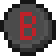            | B_BUTTON |
|             X Button             |    Xbox     |          |  U+E002 |                        | X_BUTTON |
|             Y Button             |    Xbox     |          |  U+E003 |                        | Y_BUTTON |
|             LB Button            |    Xbox     |          |  U+E004 |                       | LB_BUTTON |
|             RB Button            |    Xbox     |          |  U+E005 |                       | RB_BUTTON |
|             LT Button            |    Xbox     |          |  U+E006 |                       | LT_BUTTON |
|             RT Button            |    Xbox     |          |  U+E007 |                       | RT_BUTTON |
|           Select Button          |    Xbox     |          |  U+E008 |                   | SELECT_BUTTON |
|           Start Button           |    Xbox     |          |  U+E009 |          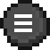          | START_BUTTON |
|         Left Stick Button        |    Xbox     |          |  U+E00A |                       | LEFT_STICK_BUTTON |
|        Right Stick Button        |    Xbox     |          |  U+E00B |                       | RIGHT_STICK_BUTTON |
|          D-Pad Up Button         |    Xbox     |          |  U+E00C |           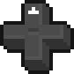          | DPAD_UP_BUTTON |
|         D-Pad Left Button        |    Xbox     |          |  U+E00D |                   | DPAD_LEFT_BUTTON |
|         D-Pad Down Button        |    Xbox     |          |  U+E00E |                   | DPAD_DOWN_BUTTON |
|        D-Pad Right Button        |    Xbox     |          |  U+E00F |                  | DPAD_RIGHT_BUTTON |
|          A Button Bright         |    Xbox     |          |  U+E010 |                 | A_BUTTON_BRIGHT |
|          B Button Bright         |    Xbox     |          |  U+E011 |                 | B_BUTTON_BRIGHT |
|          X Button Bright         |    Xbox     |          |  U+E012 |                 | X_BUTTON_BRIGHT |
|          Y Button Bright         |    Xbox     |          |  U+E013 |                 | Y_BUTTON_BRIGHT |
|               Jump               |    Mobile   |          |  U+E014 |                          | JUMP |
|              Attack              |    Mobile   |          |  U+E015 |                        | ATTACK |
|             Joystick             |    Mobile   |          |  U+E016 |           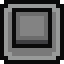           | JOYSTICK |
|             Crosshair            |    Mobile   |          |  U+E017 |                     | CROSSHAIR |
|             Interact             |    Mobile   |          |  U+E018 |            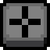          | INTERACT |
|              Crouch              |    Mobile   |          |  U+E019 |                        | CROUCH |
|              Sprint              |    Mobile   |          |  U+E01A |                        | SPRINT |
|              Fly Up              |    Mobile   |          |  U+E01B |                        | FLY_UP |
|             Fly Down             |    Mobile   |          |  U+E01C |                      | FLY_DOWN |
|             Dismount             |    Mobile   |          |  U+E01D |                      | DISMOUNT |
|           Cross Button           | PlayStation |          |  U+E020 |                          | CROSS_BUTTON |
|           Circle Button          | PlayStation |          |  U+E021 |             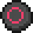             | CIRCLE_BUTTON |
|           Square Button          | PlayStation |          |  U+E022 |           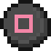          | SQUARE_BUTTON |
|          Triangle Button         | PlayStation |          |  U+E023 |                   | TRIANGLE_BUTTON |
|             L1 Button            | PlayStation |          |  U+E024 |                         | L1_BUTTON |
|             R1 Button            | PlayStation |          |  U+E025 |                         | R1_BUTTON |
|             L2 Button            | PlayStation |          |  U+E026 |                         | L2_BUTTON |
|             R2 Button            | PlayStation |          |  U+E027 |                         | R2_BUTTON |
|           Select Button          | PlayStation |          |  U+E028 |                     | SELECT_BUTTON_PS |
|           Start Button           | PlayStation |          |  U+E029 |                      | START_BUTTON_PS |
|         Left Stick Button        | PlayStation |          |  U+E02A |             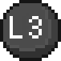            | LEFT_STICK_BUTTON_PS |
|        Right Stick Button        | PlayStation |          |  U+E02B |                         | RIGHT_STICK_BUTTON_PS |
|          D-Pad Up Button         | PlayStation |          |  U+E02C |                       | DPAD_UP_BUTTON_PS |
|         D-Pad Left Button        | PlayStation |          |  U+E02D |           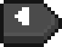          | DPAD_LEFT_BUTTON_PS |
|         D-Pad Down Button        | PlayStation |          |  U+E02E |                     | DPAD_DOWN_BUTTON_PS |
|        D-Pad Right Button        | PlayStation |          |  U+E02F |                    | DPAD_RIGHT_BUTTON_PS |
|             A Button             |   Switch    |          |  U+E040 |                    | A_BUTTON_SWITCH |
|             B Button             |   Switch    |          |  U+E041 |          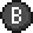          | B_BUTTON_SWITCH |
|             X Button             |   Switch    |          |  U+E042 |                    | X_BUTTON_SWITCH |
|             Y Button             |   Switch    |          |  U+E043 |          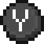          | Y_BUTTON_SWITCH |
|             L Button             |   Switch    |          |  U+E044 |                    | L_BUTTON_SWITCH |
|             R Button             |   Switch    |          |  U+E045 |                    | R_BUTTON_SWITCH |
|             ZL Button            |   Switch    |          |  U+E046 |                   | ZL_BUTTON_SWITCH |
|             ZR Button            |   Switch    |          |  U+E047 |                   | ZR_BUTTON_SWITCH |
|             - Button             |   Switch    |          |  U+E048 |                | MINUS_BUTTON_SWITCH |
|             + Button             |   Switch    |          |  U+E049 |         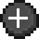        | PLUS_BUTTON_SWITCH |
|         Left Stick Button        |   Switch    |          |  U+E04A |                   | LEFT_STICK_BUTTON_SWITCH |
|        Right Stick Button        |   Switch    |          |  U+E04B |                   | RIGHT_STICK_BUTTON_SWITCH |
|          D-Pad Up Button         |   Switch    |          |  U+E04C |         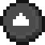        | DPAD_UP_BUTTON_SWITCH |
|         D-Pad Left Button        |   Switch    |          |  U+E04D |               | DPAD_LEFT_BUTTON_SWITCH |
|         D-Pad Down Button        |   Switch    |          |  U+E04E |        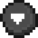       | DPAD_DOWN_BUTTON_SWITCH |
|        D-Pad Right Button        |   Switch    |          |  U+E04F |              | DPAD_RIGHT_BUTTON_SWITCH |
|         Left Mouse Button        |   Windows   |          |  U+E060 |                    | LEFT_MOUSE_BUTTON |
|        Right Mouse Button        |   Windows   |          |  U+E061 |                   | RIGHT_MOUSE_BUTTON |
|        Middle Mouse Button       |   Windows   |          |  U+E062 |                  | MIDDLE_MOUSE_BUTTON |
|               Mouse              |   Windows   |          |  U+E063 |                         | MOUSE |
|         Forward Arrow New        |    Mobile   |          |  U+E065 |             | FORWARD_ARROW_NEW |
|          Left Arrow New          |    Mobile   |          |  U+E066 |                | LEFT_ARROW_NEW |
|           Down Arrow New         |    Mobile   |          |  U+E067 |                | DOWN_ARROW_NEW |
|           Right Arrow New        |    Mobile   |          |  U+E068 |               | RIGHT_ARROW_NEW |
|          Jump Button New         |    Mobile   |          |  U+E069 |               | JUMP_BUTTON_NEW |
|         Crouch Button New        |    Mobile   |          |  U+E06A |             | CROUCH_BUTTON_NEW |
|          Inventory Button        |    Mobile   |          |  U+E06B |         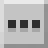     | INVENTORY_BUTTON |
|         Fly Up Button New        |    Mobile   |          |  U+E06C |             | FLY_UP_BUTTON_NEW |
|        Fly Down Button New       |    Mobile   |          |  U+E06D |           | FLY_DOWN_BUTTON_NEW |
|       Left Mouse Button New      |   Windows   |          |  U+E070 |                | LEFT_MOUSE_BUTTON_NEW |
|       Right Mouse Button New     |   Windows   |          |  U+E071 |               | RIGHT_MOUSE_BUTTON_NEW |
|      Middle Mouse Button New     |   Windows   |          |  U+E072 |              | MIDDLE_MOUSE_BUTTON_NEW |
|             Mouse New            |   Windows   |          |  U+E073 |                     | MOUSE_NEW |
|        Foward Arrow Button       |    Mobile   |          |  U+E080 |                 | FORWARD_ARROW_BUTTON |
|         Left Arrow Button        |    Mobile   |          |  U+E081 |          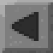          | LEFT_ARROW_BUTTON |
|      Backwards Arrow Button      |    Mobile   |          |  U+E082 |          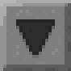          | BACKWARDS_ARROW_BUTTON |
|        Right Arrow Button        |    Mobile   |          |  U+E083 |          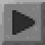         | RIGHT_ARROW_BUTTON |
|            Jump Button           |    Mobile   |          |  U+E084 |          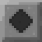         | JUMP_BUTTON |
|           Crouch Button          |    Mobile   |          |  U+E085 |                 | CROUCH_BUTTON |
|           Fly Up Button          |    Mobile   |          |  U+E086 |                 | FLY_UP_BUTTON |
|          Fly Down Button         |    Mobile   |          |  U+E087 |               | FLY_DOWN_BUTTON |
|        Craftable Toggle On       |     All     |          |  U+E0A0 |                  | CRAFTABLE_TOGGLE_ON |
|       Craftable Toggle Off       |     All     |          |  U+E0A1 |                 | CRAFTABLE_TOGGLE_OFF |
|             Food Icon            |     All     |          |  U+E100 |                          | FOOD_ICON |
|            Armor Icon            |     All     |          |  U+E101 |            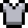            | ARMOR_ICON |
|             Minecoin             |     All     |          |  U+E102 |                      | MINECOIN |
|        Code Builder Button       |     All     |          |  U+E103 |                  | CODE_BUILDER_BUTTON |
|      Immersive Reader Button     |     All     |          |  U+E104 |       | IMMERSIVE_READER_BUTTON |
|               Token              |     All     |          |  U+E105 |                         | TOKEN |
|            Hollow Star           |     All     |          |  U+E106 |                   | HOLLOW_STAR |
|             Solid Star           |     All     |          |  U+E107 |                    | SOLID_STAR |
|           Wooden Pickaxe         |     All     |          |  U+E108 |                | WOODEN_PICKAXE |
|            Wooden Sword          |     All     |          |  U+E109 |                  | WOODEN_SWORD |
|           Crafting Table         |     All     |          |  U+E10A |                | CRAFTING_TABLE |
|              Furnace             |     All     |          |  U+E10B |                       | FURNACE |
|               Heart              |     All     |          |  U+E10C |                         | HEART |
|         Left Grab Button         |  Windows MR |          |  U+E0C0 |             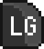            | LEFT_GRAB_BUTTON |
|         Right Grab Button        |  Windows MR |          |  U+E0C1 |                         | RIGHT_GRAB_BUTTON |
|            Menu Button           |  Windows MR |          |  U+E0C2 |                       | MENU_BUTTON |
|         Left Stick Button        |  Windows MR |          |  U+E0C3 |                         | LEFT_STICK_BUTTON_MR |
|        Right Stick Button        |  Windows MR |          |  U+E0C4 |                         | RIGHT_STICK_BUTTON_MR |
|       Left Touchpad Button       |  Windows MR |          |  U+E0C5 |              | LEFT_TOUCHPAD_BUTTON |
|  Left Touchpad Horizontal Button |  Windows MR |          |  U+E0C6 |   | LEFT_TOUCHPAD_HORIZONTAL_BUTTON |
|   Left Touchpad Vertical Button  |  Windows MR |          |  U+E0C7 |     | LEFT_TOUCHPAD_VERTICAL_BUTTON |
|       Right Touchpad Button      |  Windows MR |          |  U+E0C8 |             | RIGHT_TOUCHPAD_BUTTON |
| Right Touchpad Horizontal Button |  Windows MR |          |  U+E0C9 | 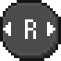 | RIGHT_TOUCHPAD_HORIZONTAL_BUTTON |
|  Right Touchpad Vertical Button  |  Windows MR |          |  U+E0CA |    | RIGHT_TOUCHPAD_VERTICAL_BUTTON |
|        Left Trigger Button       |  Windows MR |          |  U+E0CB |                         | LEFT_TRIGGER_BUTTON |
|       Right Trigger Button       |  Windows MR |          |  U+E0CC |                         | RIGHT_TRIGGER_BUTTON |
|              Windows             |  Windows MR |          |  U+E0CD |          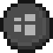          | WINDOWS |
|             0 Button             |     Rift    |          |  U+E0E0 |                     | ZERO_BUTTON |
|             A Button             |     Rift    |          |  U+E0E1 |                        | RIFT_A_BUTTON |
|             B Button             |     Rift    |          |  U+E0E2 |                        | RIFT_B_BUTTON |
|         Left Grab Button         |     Rift    |          |  U+E0E3 |                         | LEFT_GRAB_BUTTON_RIFT |
|         Right Grab Button        |     Rift    |          |  U+E0E4 |             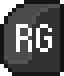            | RIGHT_GRAB_BUTTON_RIFT |
|         Left Stick Button        |     Rift    |          |  U+E0E5 |                       | LEFT_STICK_BUTTON_RIFT |
|        Right Stick Button        |     Rift    |          |  U+E0E6 |                       | RIGHT_STICK_BUTTON_RIFT |
|        Left Trigger Button       |     Rift    |          |  U+E0E7 |                       | LEFT_TRIGGER_BUTTON_RIFT |
|       Right Trigger Button       |     Rift    |          |  U+E0E8 |                       | RIGHT_TRIGGER_BUTTON_RIFT |
|             X Button             |     Rift    |          |  U+E0E9 |            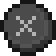            | RIFT_X_BUTTON |
|             Y Button             |     Rift    |          |  U+E0EA |                        | RIFT_Y_BUTTON |
